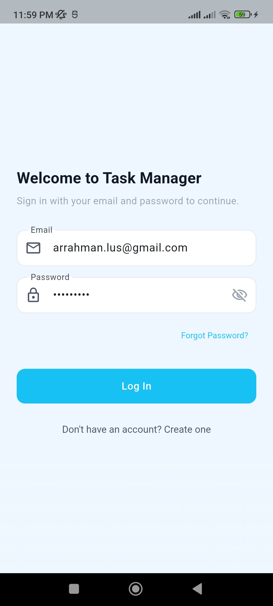
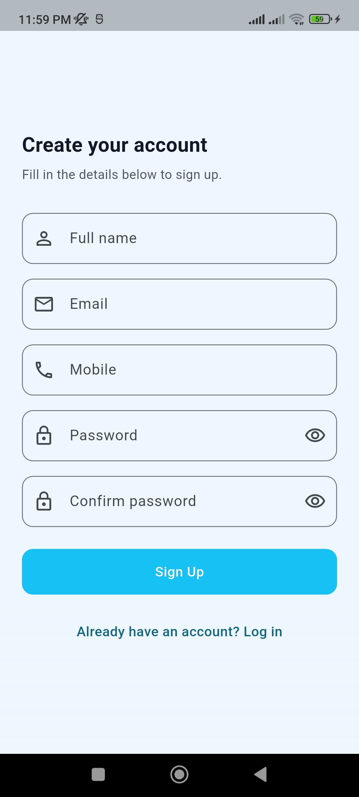
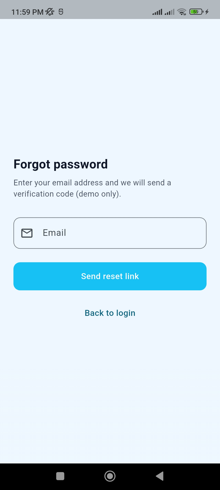
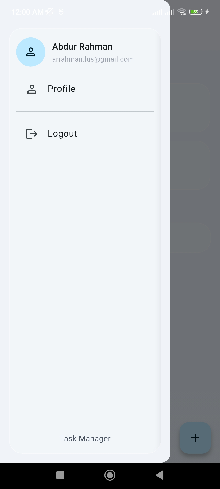
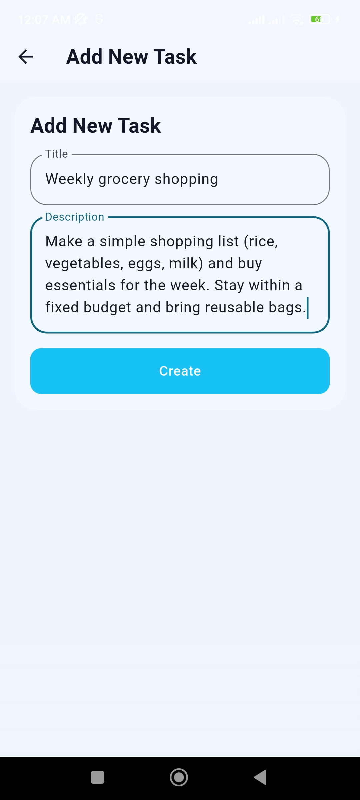
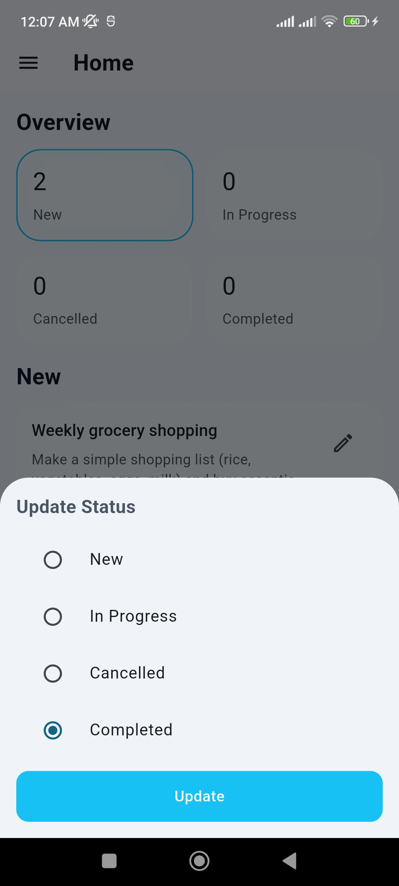
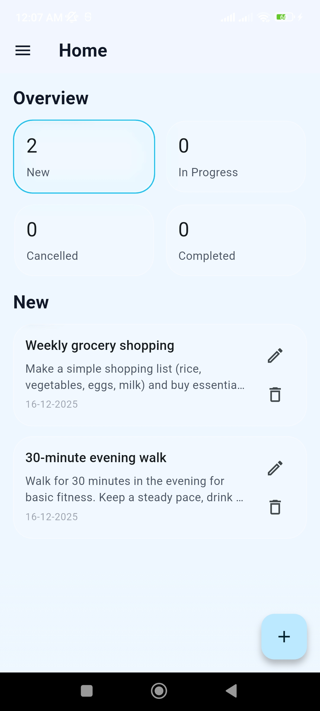
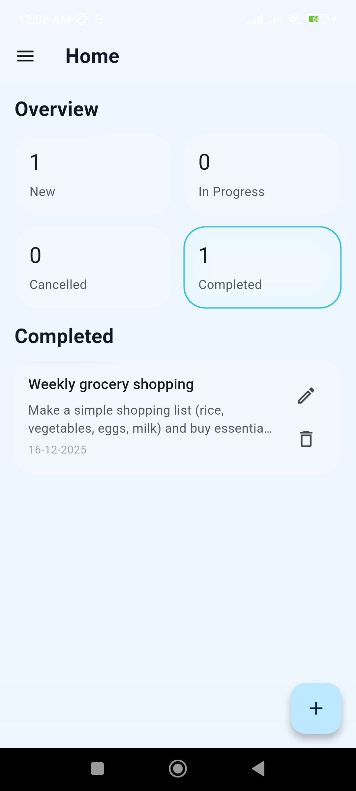
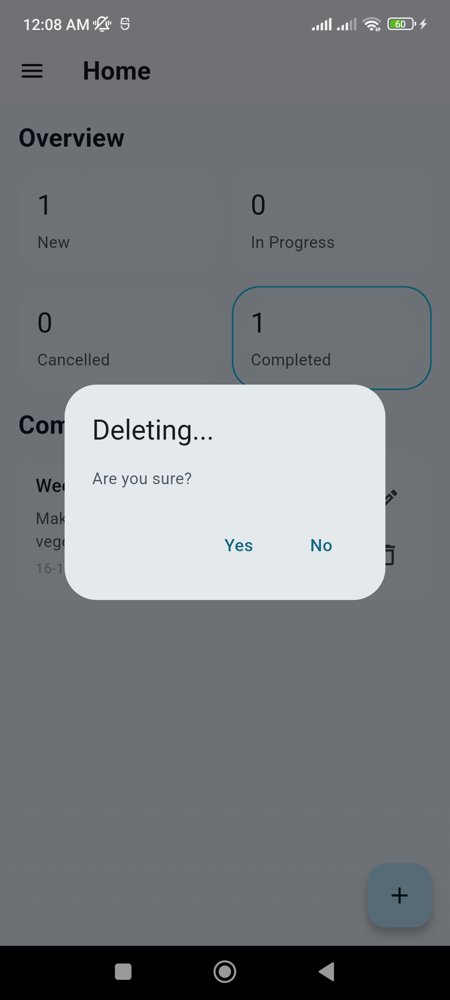

# Task Manager (Flutter)

A clean and modern Task Manager app built with Flutter.  
It supports task creation, status-wise task listing, status update, deletion, and status count overview using REST API integration.

<br>

## Project Status

- Current phase completed: REST API integration + UI restoration (pre-GetX)
- Next phase (planned): migrate state handling to GetX (controllers, reactive state, route bindings)

<br>

## Key Features

- Task CRUD via REST API
    - Create task (default status: New)
    - List tasks by status
    - Update task status
    - Delete task
- Status overview
    - Show count cards for each status (New, In Progress, Cancelled, Completed)
    - Tap a status card to filter tasks by status
- UI/UX
    - GlassContainer-based layout and consistent spacing
    - Pull-to-refresh for counts and current status list
    - Bottom sheet for status update with radio selection
- Session display
    - Show user name and email from SessionManager on Home screen

<br>

## Screenshots

Add your screenshots in a folder like: assets/screenshots/  
Recommended naming: 01.jpg to 10.jpg

<div>
  
  
</div>

<br>

<div>
  
  
</div>

<br>

<div>
  
  
</div>

<br>

<div>
  
  
</div>

<br>

<div>
  
  
</div>

<br>

## API Endpoints Used

These are the endpoints currently used by the app (see `lib/data/remote/task_api.dart`):

- GET `/taskStatusCount`
- GET `/listTaskByStatus/{status}`
- POST `/createTask`
- GET `/updateTaskStatus/{id}/{status}`
- GET `/deleteTask/{id}`

Note:
- Status values are handled through a centralized mapper (`TaskStatusValue`) to keep UI labels consistent and prevent backend value mismatch.

<br>

## Folder Structure

A simplified overview of the main app structure:

```text
task-manager/
├─ .dart_tool/
├─ .idea/
├─ android/
├─ assets/
├─ build/
├─ ios/
├─ lib/
│  ├─ main.dart
│  ├─ app/
│  │  └─ app.dart
│  ├─ core/
│  │  ├─ constants/
│  │  │  ├─ app_assets.dart
│  │  │  ├─ app_colors.dart
│  │  │  ├─ app_radius.dart
│  │  │  ├─ app_spacing.dart
│  │  │  └─ app_typography.dart
│  │  ├─ network/
│  │  │  ├─ api_client.dart
│  │  │  ├─ api_config.dart
│  │  │  └─ api_exception.dart
│  │  ├─ storage/
│  │  │  ├─ local_storage.dart
│  │  │  └─ storage_keys.dart
│  │  ├─ theme/
│  │  │  └─ app_theme.dart
│  │  └─ widgets/
│  │     ├─ app_drawer.dart
│  │     ├─ app_loader.dart
│  │     ├─ app_snackbar.dart
│  │     ├─ glass_container.dart
│  │     ├─ primary_button.dart
│  │     └─ screen_background.dart
│  ├─ data/
│  │  ├─ local/
│  │  │  └─ local_storage.dart
│  │  └─ remote/
│  │     ├─ api_client.dart
│  │     ├─ auth_api.dart
│  │     └─ task_api.dart
│  ├─ features/
│  │  ├─ auth/
│  │  │  ├─ forgot_password_otp_screen.dart
│  │  │  ├─ forgot_password_screen.dart
│  │  │  ├─ login_screen.dart
│  │  │  ├─ register_screen.dart
│  │  │  └─ reset_password_screen.dart
│  │  ├─ home/
│  │  │  └─ home_screen.dart
│  │  ├─ profile/
│  │  │  └─ profile_screen.dart
│  │  ├─ splash/
│  │  │  ├─ splash_controller.dart
│  │  │  └─ splash_screen.dart
│  │  └─ tasks/
│  │     ├─ models/
│  │     │  └─ task_item.dart
│  │     ├─ screens/
│  │     │  └─ add_task_screen.dart
│  │     ├─ widgets/
│  │     │  ├─ status_count_card.dart
│  │     │  ├─ task_list_tile.dart
│  │     │  └─ update_status_sheet.dart
│  │     ├─ add_task_screen.dart
│  │     ├─ task_model.dart
│  │     ├─ task_status.dart
│  │     └─ task_status_value.dart
│  ├─ routing/
│  │  ├─ app_router.dart
│  │  └─ route_names.dart
│  └─ session/
│     └─ session_manager.dart
├─ test/
├─ .flutter-plugins-dependencies
├─ .gitignore
├─ .metadata
├─ analysis_options.yaml
├─ pubspec.lock
├─ pubspec.yaml
├── README.md
└── LICENSE
````

<br>

## Getting Started

### Prerequisites
- Flutter SDK installed
- A running backend API (base URL should be configured in your API config file)

### Steps
- Clone the repository
- Install dependencies
    - `flutter pub get`
- Configure API base URL
    - Check your API configuration file under `lib/core/network/` or `lib/data/remote/`
- Run the app
    - `flutter run`

<br>

## Development Notes

- Status handling is centralized in `TaskStatusValue`
    - Keeps internal status values consistent (example: internal value can be `Progress` while UI label shows `In Progress`)
    - Normalizes backend inputs to avoid mismatched counts and filtering issues
- API calls that include `status` or `id` in the URL are safely encoded to avoid issues with spaces or special characters

<br>

## License

This project is licensed under the custom license included in the repository.  
See the `LICENSE` file for details.

<br>

## Author

Abdur Rahman  
GitHub: arrahman10  
Email: arrahman.lus@gmail.com
